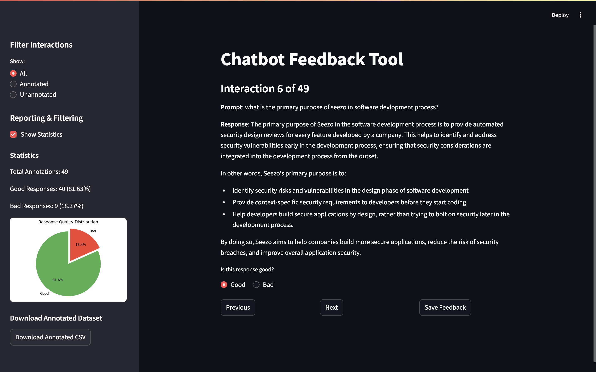

# **ChatBot** 🤖


This repository contains the implementation of an end-to-end pipeline for a customer-facing chatbot with observability, feedback, and analytics using **Phoenix by Arize**. The project demonstrates LLM observability, tracing, evaluation workflows, and human-in-the-loop annotation.
For a detailed walkthrough of the project, check out the demo video:  [](https://www.youtube.com/watch?v=Y1J92fNNjNk)



---

## **Table of Contents**
1. [Overview](#overview)
2. [Features](#features)
3. [Setup Instructions](#setup-instructions)
4. [Usage](#usage)
   - [Chatbot](#chatbot)
   - [Feedback Tool](#feedback-tool)
5. [Exported Data](#exported-data)

---

## **Overview**

The goal of this project is to create a realistic workflow where the outputs of AI models are continuously monitored, reviewed, and improved over time. The solution includes:
- A **Customer Success Chatbot** powered by a large language model (LLM).
- **Phoenix integration** for capturing traces and spans of LLM interactions.
- A **Feedback Tool** for human-in-the-loop annotation of responses.
- **Analytics & Reporting** to visualize trends in annotations.


---

## **Features**


- **Phoenix Observability**: Captures prompts, responses, metadata (latency, timestamps, model info, etc.) as traces/spans.
- **Customer Success Chatbot**: Supports Q&A for product-related queries and troubleshooting.
- **Feedback Tool**: Allows users to annotate responses as "Good" or "Bad" via a Streamlit-based UI.
- **Multi-Turn Conversations**: Preserves context across multiple turns.
- **Automated Export**: Exports Phoenix trace data programmatically.
- **Analytics Dashboard**: Provides reporting features such as total annotations, good vs. bad ratio, and filtering options.

---

## **Setup Instructions**

### Prerequisites
- Python 3.13.2
- Phoenix
- ChromaDB
- Streamlit
- Groq(model = llama3-70b-8192) API Key (or any other LLM provider)

### Installation
1. Clone the repository:
   ```bash
   git clone https://github.com/Ravindrakapse/Seezo-ChatBot.git
   cd Seezo-ChatBot
   ```
2. Install dependencies:
   ```bash
   pip install -r requirements.txt
   ```

3. Set up environment variables:
     ```plaintext
     GROQ_API_KEY=your_groq_api_key
     
     ```

4. Launch Phoenix:
   ```python
   import phoenix as px
   session = px.launch_app()
   ```

5. Run the Jupyter Notebook:

---

## **Usage**

### **Chatbot**
1. Open the `chatbot.ipynb` notebook.
2. Run the cells to start the chatbot.
3. Interact with the chatbot in the provided input box.
4. All interactions are logged in Phoenix for observability.

### **Feedback Tool**
1. Navigate to the `feedback_tool.py` directory.
2. Run the Streamlit app:
   ```bash
   streamlit run feedback_tool.py
   ```
3. Use the interface to:
   - Filter interactions (All, Annotated, Unannotated).
   - Annotate responses as "Good" or "Bad".
   - View statistics and download annotated data.

---

## **Exported Data**

- Trace data is exported to `new_csv.csv` in the root directory.
- Annotated data is saved to `annotated_traces.csv`.
- Both files include fields like `prompt`, `response`, `timestamp`, `latency`, `model_name`, etc.

---
